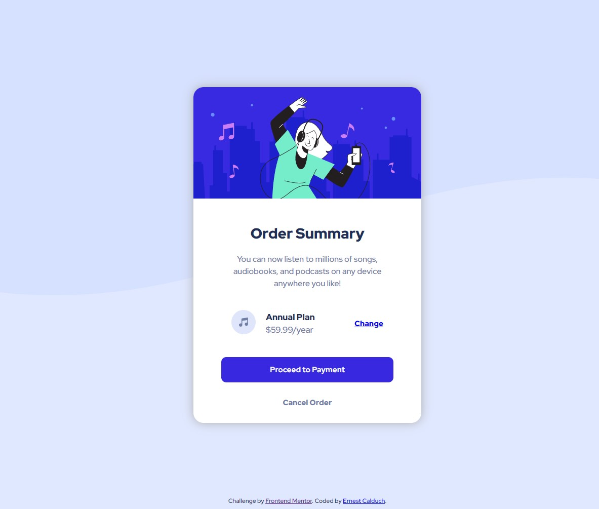

# Frontend Mentor - Order summary card solution

This is a solution to the [Order summary card challenge on Frontend Mentor](https://www.frontendmentor.io/challenges/order-summary-component-QlPmajDUj).

## Table of contents

- [Overview](#overview)
  - [The challenge](#the-challenge)
  - [Screenshot](#screenshot)
  - [Links](#links)
- [My process](#my-process)
  - [Built with](#built-with)
- [Author](#author)

## Overview

### The challenge

Users should be able to:

- See hover states for interactive elements

### Screenshot

### Links

- Solution URL: [GitHub](https://github.com/ErnestCalduch/Order-summary-component.git)
- Live Site URL: [Netlify](https://order-summary-component-ernestcalduch.netlify.app/)

## My process

### Built with

- Semantic HTML5 markup
- CSS custom properties
- Flexbox
- Responsive workflow (1 breakpoint)

## Author

- Website - [Netlify](https://app.netlify.com/teams/ernest231/overview)
- Frontend Mentor - [@ErnestCalduch](https://www.frontendmentor.io/profile/ErnestCalduch)